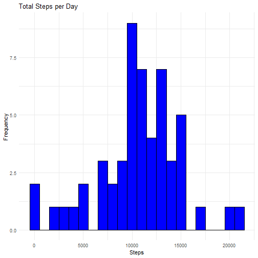
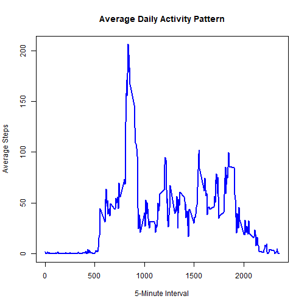
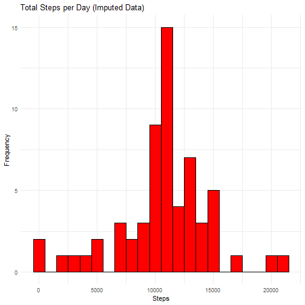
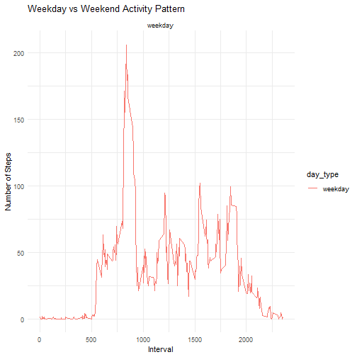

# Loading and Preprocessing the Data

``` r
library(ggplot2)
library(dplyr)
library(lattice)
```

```
## Warning: package 'lattice' was built under R version 4.4.2
```

``` r
# Load the data
activity_data <- read.csv("activity.csv")

# Convert date column to Date type
activity_data$date <- as.Date(activity_data$date, format="%Y-%m-%d")

# Remove NA values for steps
activity_clean <- na.omit(activity_data)
```

# Mean Total Number of Steps Taken Per Day

``` r
# Calculate total number of steps per day
total_steps_per_day <- activity_clean %>%
  group_by(date) %>%
  summarize(total_steps = sum(steps))

# Plot histogram of total steps per day
ggplot(total_steps_per_day, aes(x = total_steps)) +
  geom_histogram(binwidth = 1000, fill = "blue", color = "black") +
  labs(title = "Total Steps per Day", x = "Steps", y = "Frequency") +
  theme_minimal()
```



``` r
# Calculate mean and median total steps per day
mean_steps <- mean(total_steps_per_day$total_steps)
median_steps <- median(total_steps_per_day$total_steps)

# Print results
print(paste("Mean total steps per day:", mean_steps))
```

```
## [1] "Mean total steps per day: 10766.1886792453"
```

``` r
print(paste("Median total steps per day:", median_steps))
```

```
## [1] "Median total steps per day: 10765"
```

# Average Daily Activity Pattern

``` r
# Calculate average daily activity pattern
average_activity <- activity_clean %>%
  group_by(interval) %>%
  summarize(avg_steps = mean(steps))

# Plot time series of average steps per 5-minute interval
plot(average_activity$interval, average_activity$avg_steps, type = "l", 
     col = "blue", lwd = 2, xlab = "5-Minute Interval", 
     ylab = "Average Steps", main = "Average Daily Activity Pattern")
```



``` r
# Identify the interval with maximum average steps
max_interval <- average_activity[which.max(average_activity$avg_steps), ]

# Print the interval with the highest average steps
print(paste("Interval with max average steps:", max_interval$interval))
```

```
## [1] "Interval with max average steps: 835"
```

# Imputing Missing Values

``` r
# Count missing values
missing_values <- sum(is.na(activity_data$steps))
print(paste("Total missing values:", missing_values))
```

```
## [1] "Total missing values: 2304"
```

``` r
# Replace missing values with the mean for that 5-minute interval
activity_imputed <- activity_data %>%
  group_by(interval) %>%
  mutate(steps = ifelse(is.na(steps), mean(steps, na.rm = TRUE), steps)) %>%
  ungroup()

# Calculate total steps per day after imputing missing values
total_steps_imputed <- activity_imputed %>%
  group_by(date) %>%
  summarize(total_steps = sum(steps))

# Plot histogram of total steps per day after imputation
ggplot(total_steps_imputed, aes(x = total_steps)) +
  geom_histogram(binwidth = 1000, fill = "red", color = "black") +
  labs(title = "Total Steps per Day (Imputed Data)", x = "Steps", y = "Frequency") +
  theme_minimal()
```



``` r
# Calculate mean and median total steps per day after imputation
mean_steps_imputed <- mean(total_steps_imputed$total_steps)
median_steps_imputed <- median(total_steps_imputed$total_steps)

# Print results after imputation
print(paste("Mean total steps per day (imputed):", mean_steps_imputed))
```

```
## [1] "Mean total steps per day (imputed): 10766.1886792453"
```

``` r
print(paste("Median total steps per day (imputed):", median_steps_imputed))
```

```
## [1] "Median total steps per day (imputed): 10766.1886792453"
```

# Differences in Activity Patterns Between Weekdays and Weekends

``` r
# Classify dates as weekdays or weekends
activity_imputed$day_type <- ifelse(weekdays(activity_imputed$date) %in% c("Saturday", "Sunday"), "weekend", "weekday")

# Calculate average steps per interval for weekdays and weekends
activity_by_day_type <- activity_imputed %>%
  group_by(interval, day_type) %>%
  summarize(avg_steps = mean(steps))
```

```
## `summarise()` has grouped output by 'interval'. You can override
## using the `.groups` argument.
```

``` r
# Plot weekday vs weekend activity pattern using ggplot2
ggplot(activity_by_day_type, aes(x = interval, y = avg_steps, color = day_type)) +
  geom_line() +
  facet_wrap(~ day_type, ncol = 1) +
  labs(title = "Weekday vs Weekend Activity Pattern",
       x = "Interval", y = "Number of Steps") +
  theme_minimal()
```




## R Markdown

This is an R Markdown document. Markdown is a simple formatting syntax for authoring HTML, PDF, and MS Word documents. For more details on using R Markdown see <http://rmarkdown.rstudio.com>.

When you click the **Knit** button a document will be generated that includes both content as well as the output of any embedded R code chunks within the document. You can embed an R code chunk like this:


``` r
summary(cars)
```

```
##      speed           dist       
##  Min.   : 4.0   Min.   :  2.00  
##  1st Qu.:12.0   1st Qu.: 26.00  
##  Median :15.0   Median : 36.00  
##  Mean   :15.4   Mean   : 42.98  
##  3rd Qu.:19.0   3rd Qu.: 56.00  
##  Max.   :25.0   Max.   :120.00
```

## Including Plots

You can also embed plots, for example:


Note that the `echo = FALSE` parameter was added to the code chunk to prevent printing of the R code that generated the plot.
